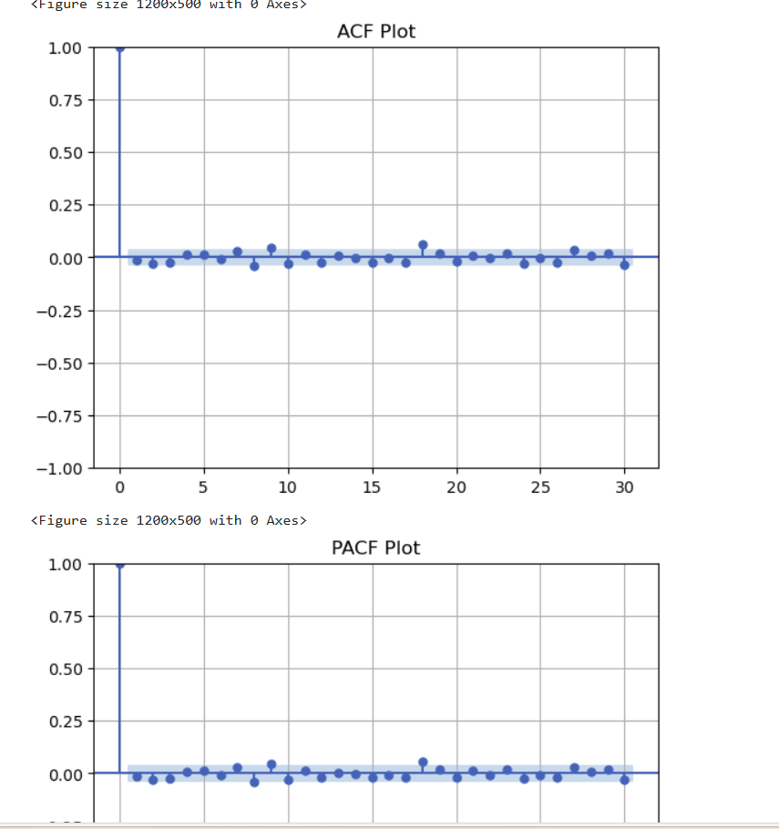
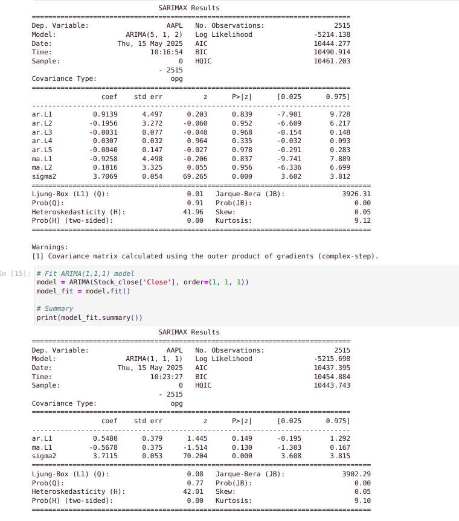
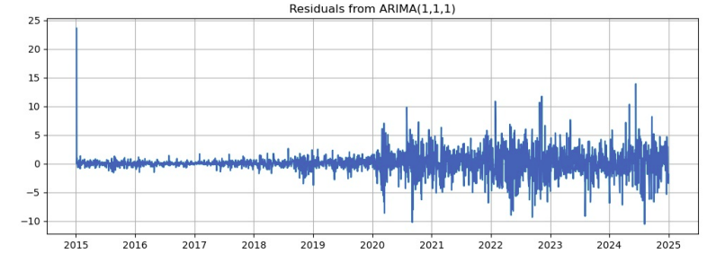
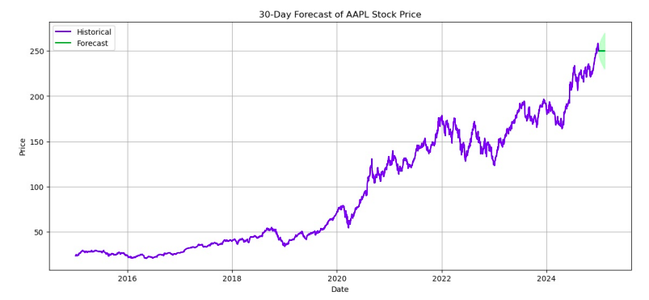
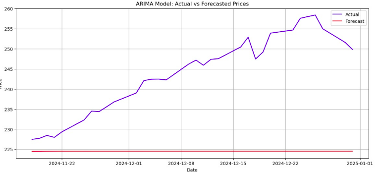

# AAPL Stock Price Forecasting with ARIMA

This project performs a complete time series analysis and forecasting of Apple Inc. (AAPL) stock prices using the ARIMA model in Python.

---

## Project Overview

- **Objective**: 
  Analyze historical stock prices of AAPL (2015–2024), model its time series behavior, and forecast the next 30 business days.

- **Tools Used**: Python, yfinance, pandas, statsmodels, sklearn, matplotlib, seaborn

- **Model Used**: ARIMA (AutoRegressive Integrated Moving Average)

## Workflow Summary

1. Data Collection
   Downloaded AAPL stock data from Yahoo Finance using yfinance.

2. Data Preprocessing
   Focused on the closing price.

   Converted dates, sorted values, and cleaned missing data.

3. Exploratory Data Analysis
   Line plot to visualize trends.

   Rolling mean & standard deviation to inspect volatility.

4. Stationarity Testing
   Used ADF test to confirm non-stationarity.

   Applied first-order differencing to remove trend.

5. Model Identification
   ACF and PACF plots suggested AR(1) and MA(1) → ARIMA(1,1,1)

7. Model Training
   Fit two models: ARIMA(5,1,2) and ARIMA(1,1,1).

   Selected ARIMA(1,1,1) based on lower AIC and simplicity.

  

7. Residual Diagnostics
   Residuals behaved like white noise.

  
   Passed Ljung-Box test (p-value > 0.05).

8. Forecasting
   Forecasted next 30 business days with confidence intervals.

   

10. Model Evaluation
    Used RMSE, and MAE.

### Performance Metrics
  Metric	Value
  
  RMSE	21.10
  
  MAE	 18.88
  

 Comparison of actual vs predicted.

### Key Visualizations

  AAPL Price Over Time

  Rolling Mean & Std

  ACF & PACF Plots

  Residual Plots

  Actual vs Fitted

  Forecast with Confidence Intervals

### Key Insights
 AAPL prices show strong upward trends — non-stationary in nature.

 ARIMA(1,1,1) offers a simple yet effective model for short-term forecasting.

 Residuals confirm model adequacy (no autocorrelation).

 Future price trends align with historical momentum.
